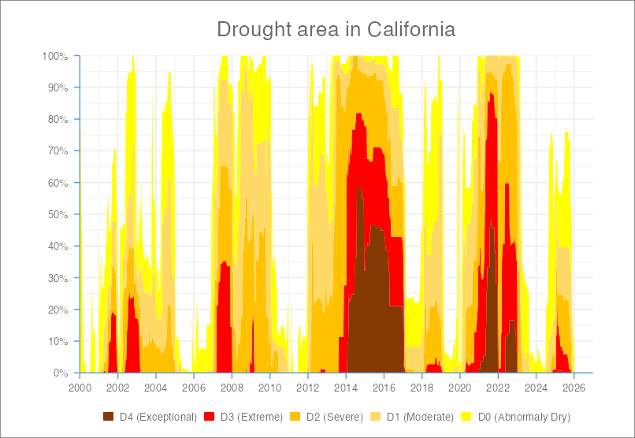
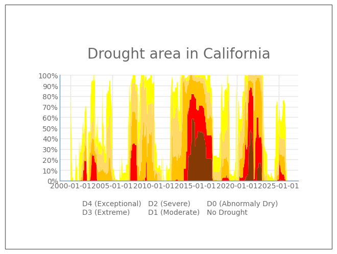

##  Let's write & run some Python code {#code}

### Exercise 0: Create a new local project {#exercise0}

Let's start by creating a local repository (project) to store our work.

1. **Open Positron** and click on File > New Folder from Template... > Empty Project > give it a name (e.g. intro-python) and select where on your computer you'd like to save it to > click Create

2. **Create two folders inside your project named `exercise1` and `exercise2`.** Click on the Explorer pane (it should already be open) > hover your mouse over your repository name until you see the New Folder... button > add your first folder, then repeat for the second

3. **Download a [`.gitignore`](https://github.com/UCSB-MEDS/intro-to-python/blob/main/.gitignore){target="_blank"} template file from GitHub.** A `.gitignore` file is a plain text file used to tell Git which files or folders it should intentionally ignore and not track. *While we won't be using Git / GitHub to version control our files today, it's helpful to be aware that the `.gitignore` template for Python projects looks different than R projects.* Run the following in your Positron Terminal: 

```{bash filename="Terminal"}
#| eval: false
#| echo: true
curl -O https://raw.githubusercontent.com/UCSB-MEDS/intro-to-python/refs/heads/main/.gitignore
```

::: {.callout-tip}
## cURL
[cURL](https://curl.se/){target="_blank"} (i.e. Client URL) is an open-source command-line tool used by developers to transfer data to or from a server. It makes it easy to download a URL from a web server over HTTP. We'll use this again in the next exercise!
:::

### Exercise 1: Run existing Python code {#exercise1}

Sometimes you'll receive Python code and an environment file (`environment.yml` or `requirements.txt`) from a collaborator (like the one in the folded chunk, below). In this exercise, you will reproduce an environment and run a Python script. 

::: {.callout-note collapse="true"}
## `environment.yml`

The `environment.yml` is a text file that specifies a conda environment's name, channels to download from, and package dependencies. It is similar to a `requirements.txt` file that is used for `venv`.

```{yaml filename="environment.yml"}
name: cmip6-env
channels:
  - conda-forge
  - defaults
dependencies:
  - python=3.11
  - intake
  - intake-esm
  - s3fs
  - xarray
  - zarr
  - matplotlib
  - numpy
  - pandas
  - jupyter
  - ipykernel
```
:::

1. **Download the [`environment.yml`](https://github.com/UCSB-MEDS/intro-to-python/blob/main/exercises/environment.yml){target="_blank"} and [intro-to-python.ipynb](https://github.com/UCSB-MEDS/intro-to-python/blob/main/exercises/intro-to-python.ipynb){target="_blank"}** from GitHub and save them to your project directory. You can do this in the Terminal by running:

```{bash filename="Terminal"}
#| eval: false
#| echo: true

# Download the environment.yml
curl -O https://raw.githubusercontent.com/UCSB-MEDS/intro-to-python/main/exercises/environment.yml

# Download the intro-to-python.ipynb notebook
curl -O https://raw.githubusercontent.com/UCSB-MEDS/intro-to-python/main/exercises/intro-to-python.ipynb
```

- You can drag and drop these files into your `exercise1/` folder

2. **Create the `cmip6-env` conda environment** from our downloaded `environment.yml` file:

```{bash filename="Terminal"}
#| eval: false
#| echo: true
conda env create -f exercise1/environment.yml
```

3. **Activate the environment.** You'll want to make sure you're in your correct environment (you should see `(cmip6-env)` at the start of your command line when `cmip6-env` is correctly activated) before installing packages:

```{bash filename="Terminal"}
#| eval: false
#| echo: true
conda activate cmip6-env
```

4. **Register `cmip6-env` as a Jupyter kernel** so it's available as a notebook interpreter:

```{bash filename="Terminal"}
#| eval: false
#| echo: true
python -m ipykernel install --user --name cmip6-env --display-name "Python (cmip6-env)"
```

5. **Open `intro-to-python.ipynb` (in Positron) and select `cmip6-env` as your interpreter.** Click the interpreter selector in the top right of the Jupyter Notebook and choose `Python (cmip6-env)`. 

6. **Run through all the cells** in the Jupyter Notebook.

### Exercise 2: Translating R to Python

Let's say you already have some R code for reproducing the [US Drought Monitor](https://droughtmonitor.unl.edu/){target="_blank"}'s ["Drought area in California" visualization](https://en.wikipedia.org/wiki/Droughts_in_California#/media/File:Drought_area_in_California.svg){target="_blank"}, and you'd like to translate it to Python:

::: {.callout-note collapse="true"}
## Expand for R code
```{r}
#| eval: false
#| echo: true
#| message: false
#| warning: false
##~~~~~~~~~~~~~~~~~~~~~~~~~~~~~~~~~~~~~~~~~~~~~~~~~~~~~~~~~~~~~~~~~~~~~~~~~~~~~~
##                                    setup                                 ----
##~~~~~~~~~~~~~~~~~~~~~~~~~~~~~~~~~~~~~~~~~~~~~~~~~~~~~~~~~~~~~~~~~~~~~~~~~~~~~~

#..........................load packages.........................
library(tidyverse)

#..........................import data...........................
drought <- read_csv(here::here("data", "drought.csv"))

##~~~~~~~~~~~~~~~~~~~~~~~~~~~~~~~~~~~~~~~~~~~~~~~~~~~~~~~~~~~~~~~~~~~~~~~~~~~~~~
##                            wrangle drought data                          ----
##~~~~~~~~~~~~~~~~~~~~~~~~~~~~~~~~~~~~~~~~~~~~~~~~~~~~~~~~~~~~~~~~~~~~~~~~~~~~~~

drought_clean <- drought |>
  
  # pivot table to be in tidy form ----
  pivot_longer(cols = none:d4, names_to = "drought_lvl", values_to = "area_pct") |>
  
  # select cols of interest & update names for clarity (as needed) ----
  select(start_date, state_abb, drought_lvl, area_pct) |> 
  
  # coerce start_date to date ----
  mutate(start_date = mdy(start_date)) |> 

  # add drought level conditions names ---- 
  mutate(drought_lvl_long = factor(drought_lvl,
                                   levels = c("d4", "d3", "d2", "d1", "d0", "none"),
                                   labels = c("D4 (Exceptional)", "D3 (Extreme)",
                                       "D2 (Severe)", "D1 (Moderate)", 
                                       "D0 (Abnormaly Dry)", 
                                       "No Drought"))) |>
  
  # reorder cols ----
  relocate(start_date, state_abb, drought_lvl, drought_lvl_long, area_pct) |>

  # remove drought_lvl "none" & filter for just CA ----
  filter(drought_lvl != "none",
         state_abb == "CA") |> 

##~~~~~~~~~~~~~~~~~~~~~~~~~~~~~~~~~~~~~~~~~~~~~~~~~~~~~~~~~~~~~~~~~~~~~~~~~~~~~~
##       create stacked area plot of CA drought conditions through time     ----
##~~~~~~~~~~~~~~~~~~~~~~~~~~~~~~~~~~~~~~~~~~~~~~~~~~~~~~~~~~~~~~~~~~~~~~~~~~~~~~
  
# initialize ggplot ----
ggplot(drought_clean, mapping = aes(x = start_date, y = area_pct, fill = drought_lvl_long)) +
  
  # reverse order of groups so level D4 is closest to x-axis ----
  geom_area(position = position_stack(reverse = TRUE)) +
  
  # update colors to match US Drought Monitor ----
  # (colors identified using ColorPick Eyedropper extension on the original USDM data viz) 
  scale_fill_manual(values = c("#853904", "#FF0000", "#FFC100", "#FFD965", "#FFFF00")) +
  
  # set x-axis breaks & remove padding between data and x-axis ----
  scale_x_date(breaks = scales::breaks_pretty(n = 13),
               limits = as.Date(c("2000-01-01", "2026-12-31")),
               expand = c(0,0)) +

  # set y-axis breaks & remove padding between data and y-axis & convert values to percentages ----
  scale_y_continuous(breaks = seq(0, 100, by = 10),
                     expand = c(0, 0),
                     labels = scales::label_percent(scale = 1)) +
  
  # add title ----
  labs(title = "Drought area in California") +

  # set theme minimal (includes major/minor grid lines, no axes) ----
  theme_minimal() +
  
  # fine-tune adjustments to plot theme ----
  theme(
    
    # update axis lines & ticks color ----
    axis.line = element_line(color = "#5A9CD6"),
    axis.ticks = element_line(color = "#5A9CD6"),
    
    # adjust length of axis ticks ----
    axis.ticks.length = unit(.2, "cm"),
    
    # center plot title ----
    plot.title = element_text(hjust = 0.5, color = "#686868", size = 20,
                              margin = margin(t = 10, r = 0, b = 15, l = 0)),
    
    # remove axis & legend titles ----
    axis.title = element_blank(),
    legend.title = element_blank(),
    
    # axis text color & size ----
    axis.text = element_text(color = "#686868", size = 10),
    legend.text = element_text(color = "#686868", size = 10),
    
    # move legend below plot ----
    legend.position = "bottom",
    legend.direction = "horizontal",
    legend.key.width = unit(0.4, "cm"),
    legend.key.height = unit(0.25, "cm"),
    
    # update plot background color & plot margins ----
    plot.background = element_rect(color = "#686868"),
    plot.margin = margin(t = 10, r = 40, b = 10, l = 40)
  )

```

::: {.center-text}
{width="100%" fig-alt="Stacked area chart of drought area in CA by severity from 2000-2026."}
:::
:::

1. **Download the necessary data** and save it to `exercise2/data/` (you'll need to create a `data/` folder inside `exericse2/` then drag and drop `drought.csv` into it):

```{bash filename="Terminal"}
#| eval: false
#| echo: true
curl -O https://raw.githubusercontent.com/UCSB-MEDS/intro-to-python/refs/heads/main/data/drought.csv
```

2. **Let's try to use [claude.ai](https://claude.ai/){target="_blank"} (or your preferred GenAI chatbot) to translate our R code into Python code**. Try sharing the R code, above, along with the prompt,

>Translate this R code into Python code using pandas and pyjanitor for the data wrangling and plotnine for the data viz 

::: {.callout-tip}
## Tell your AI tool which Python packages you want to use
Check out [this slide](https://docs.google.com/presentation/d/1Q7PZRSdZFcdeg-N73ibxHnAbVq-8uFhD5KHtr8SkNXI/edit?slide=id.g3e21014f16a_0_0#slide=id.g3e21014f16a_0_0){target="_blank"} for Python equivalents to your favorite R packages.
:::

3. **Add a new Python script named, `drought.py` to your `exercise2/` folder and copy the AI-generated code into it.** Yours may look a bit different than ours (and everyone else's around you).

::: {.callout-note collapse="true"}
## Expand for AI-generated Python code
```{python}
#| eval: false
#| echo: true
#| message: false
#| warning: false
##~~~~~~~~~~~~~~~~~~~~~~~~~~~~~~~~~~~~~~~~~~~~~~~~~~~~~~~~~~~~~~~~~~~~~~~~~~~~~~
##                                    setup                                 ----
##~~~~~~~~~~~~~~~~~~~~~~~~~~~~~~~~~~~~~~~~~~~~~~~~~~~~~~~~~~~~~~~~~~~~~~~~~~~~~~

#..........................load packages.........................
import pandas as pd
import janitor
from plotnine import *

#..........................import data...........................
drought = pd.read_csv("data/drought.csv")

##~~~~~~~~~~~~~~~~~~~~~~~~~~~~~~~~~~~~~~~~~~~~~~~~~~~~~~~~~~~~~~~~~~~~~~~~~~~~~~
##                            wrangle drought data                          ----
##~~~~~~~~~~~~~~~~~~~~~~~~~~~~~~~~~~~~~~~~~~~~~~~~~~~~~~~~~~~~~~~~~~~~~~~~~~~~~~

drought_clean = (
    drought
    # pivot table to be in tidy form ----
    .melt(id_vars=[c for c in drought.columns if c not in ["None","D0","D1","D2","D3","D4"]],
          var_name="drought_lvl", value_name="area_pct")
    # clean up col names ----
    .clean_names()
    # rename state abbreviation column ----
    .rename(columns={"state_abbreviation": "state_abb"})
    # select cols of interest ----
    .rename(columns={"valid_start": "date"})
    .loc[:, ["date", "state_abb", "drought_lvl", "area_pct"]]
    # add drought level condition names ----
    .assign(
        date=lambda df: pd.to_datetime(df["date"]),
        drought_lvl_long=lambda df: pd.Categorical(
            df["drought_lvl"].map({
                "D4": "D4 (Exceptional)", "D3": "D3 (Extreme)",
                "D2": "D2 (Severe)",      "D1": "D1 (Moderate)",
                "D0": "D0 (Abnormaly Dry)", "None": "No Drought"
            }),
            categories=["D4 (Exceptional)", "D3 (Extreme)", "D2 (Severe)",
                        "D1 (Moderate)", "D0 (Abnormaly Dry)", "No Drought"],
            ordered=True
        )
    )
    # reorder cols ----
    [["date", "state_abb", "drought_lvl", "drought_lvl_long", "area_pct"]]
)

##~~~~~~~~~~~~~~~~~~~~~~~~~~~~~~~~~~~~~~~~~~~~~~~~~~~~~~~~~~~~~~~~~~~~~~~~~~~~~~
##       create stacked area plot of CA drought conditions through time     ----
##~~~~~~~~~~~~~~~~~~~~~~~~~~~~~~~~~~~~~~~~~~~~~~~~~~~~~~~~~~~~~~~~~~~~~~~~~~~~~~

(
    drought_clean
    # remove drought_lvl "None" & filter for just CA ----
    [lambda df: (df["drought_lvl"] != "None") & (df["state_abb"] == "CA")]
    .pipe(lambda df: (
        ggplot(df, aes(x="date", y="area_pct", fill="drought_lvl_long"))
        # reverse order of groups so level D4 is closest to x-axis ----
        + geom_area(position=position_stack(reverse=True))
        # update colors to match US Drought Monitor ----
        + scale_fill_manual(values=["#853904", "#FF0000", "#FFC100", "#FFD965", "#FFFF00"])
        # set x-axis breaks & remove padding ----
        + scale_x_datetime(
            breaks=date_breaks("2 years"),
            date_labels="%Y",
            limits=(pd.Timestamp("2000-01-01"), pd.Timestamp("2026-12-31")),
            expand=(0, 0)
        )
        # set y-axis breaks & remove padding & convert to percentages ----
        + scale_y_continuous(
            breaks=range(0, 101, 10),
            expand=(0, 0),
            labels=lambda lst: [f"{v}%" for v in lst]
        )
        # add title ----
        + labs(title="Drought area in California")
        # set theme minimal ----
        + theme_minimal()
        # fine-tune adjustments to plot theme ----
        + theme(
            axis_line=element_line(color="#5A9CD6"),
            axis_ticks=element_line(color="#5A9CD6"),
            axis_ticks_length=0.2,
            plot_title=element_text(ha="center", color="#686868", size=20,
                                    margin={"t": 10, "r": 0, "b": 15, "l": 0}),
            axis_title=element_blank(),
            legend_title=element_blank(),
            axis_text=element_text(color="#686868", size=10),
            legend_text=element_text(color="#686868", size=10),
            legend_position="bottom",
            legend_direction="horizontal",
            legend_key_width=0.4,
            legend_key_height=0.25,
            plot_background=element_rect(color="#686868"),
            plot_margin=0.1
        )
    ))
)
```
::: 

4. **Create a new `conda` environment called `drought-env` with Python 3.11.** While Python 3.13 is the latest version, many packages commonly used for environmental data science work haven't been updated to support it yet, so we recommend using 3.11 to avoid compatibility issues:

```{bash filename="Terminal"}
#| eval: false
#| echo: true
conda create -n drought-env python=3.11
```

5. **Activate your `drought-env` environment:**

```{bash filename="Terminal"}
#| eval: false
#| echo: true
conda activate drought-env
```

6. **Install the necessary packages to your `drought-env` from the `conda-forge` channel** (reminder: [conda-forge](https://conda-forge.org/docs/user/introduction/){target="_blank"} is a large repository of community-maintained Python packages):

```{bash filename="Terminal"}
#| eval: false
#| echo: true
conda install -c conda-forge pandas plotnine ipykernel pyjanitor
```

7. **Optionally, export your environment to an `environment.yml` file** so others can reproduce it. Use the `--from-history` flag to export only the packages you explicitly installed, rather than all of their dependencies. This makes the file more portable across operating systems; instead of locking in your machine's specific dependencies, it lets conda resolve the right ones for each user's OS.

```{bash filename="Terminal"}
#| eval: false
#| echo: true
conda env export --from-history > exercise2/environment.yml
```

8. **Register `drought-env` as a Jupyter kernel** so that Positron can find and use it as an interpreter: 

```{bash filename="Terminal"}
#| eval: false
#| echo: true
python -m ipykernel install --user --name drought-env --display-name "Python (drought-env)"
```

9. **Restart Positron, then select your interpreter** by clicking the Interpreter Picker (top right corner of Positron) > click New Console Session... > choose the Python 3.11.14 (Conda: drought-env) interpreter.

10. **Try running your `drought.py` script.** *Your code will likely **not** run without some manual updates. Things to try / look out for:*

- it's helpful to run your code line-by-line
- make sure the file path for reading in your data is correct
- don't assume all packages work the same as those in R (e.g. does `pyjanitor` convert column names to snake_case, as `{janitor}` does in R?)
- check out your df in Positron's data viewer by running `%view drought_clean` in your console
- try commenting out sections of code to get things running (even if not *perfect*)
- ask AI to help interpret error messages

::: {.callout-note collapse="true"}
## Expand for manually-adjusted Python code
```{python filetype="drought.py"}
#| eval: false
#| echo: true
#| message: false
#| warning: false
##~~~~~~~~~~~~~~~~~~~~~~~~~~~~~~~~~~~~~~~~~~~~~~~~~~~~~~~~~~~~~~~~~~~~~~~~~~~~~~
##                                    setup                                 ----
##~~~~~~~~~~~~~~~~~~~~~~~~~~~~~~~~~~~~~~~~~~~~~~~~~~~~~~~~~~~~~~~~~~~~~~~~~~~~~~

#..........................load packages.........................
import pandas as pd
import janitor
from plotnine import *

#..........................import data...........................
drought = pd.read_csv("exercise2/data/drought.csv") # <1>

##~~~~~~~~~~~~~~~~~~~~~~~~~~~~~~~~~~~~~~~~~~~~~~~~~~~~~~~~~~~~~~~~~~~~~~~~~~~~~~
##                            wrangle drought data                          ----
##~~~~~~~~~~~~~~~~~~~~~~~~~~~~~~~~~~~~~~~~~~~~~~~~~~~~~~~~~~~~~~~~~~~~~~~~~~~~~~

drought_clean = (
    drought
    # pivot table to be in tidy form ----
    .melt(id_vars=[c for c in drought.columns if c not in ["None","D0","D1","D2","D3","D4"]],
          var_name="drought_lvl", value_name="area_pct")
    # clean up col names ----
    .clean_names() # <2>
    # rename state abbreviation column ----
    .rename(columns={"stateabbreviation": "stateabb"})
    # select cols of interest ----
    .rename(columns={"validstart": "date"})
    .loc[:, ["date", "stateabb", "drought_lvl", "area_pct"]]
    # add drought level condition names ----
    .assign(
        date=lambda df: pd.to_datetime(df["date"]),
        drought_lvl_long=lambda df: pd.Categorical(
            df["drought_lvl"].map({
                "D4": "D4 (Exceptional)", "D3": "D3 (Extreme)",
                "D2": "D2 (Severe)",      "D1": "D1 (Moderate)",
                "D0": "D0 (Abnormaly Dry)", "None": "No Drought"
            }),
            categories=["D4 (Exceptional)", "D3 (Extreme)", "D2 (Severe)",
                        "D1 (Moderate)", "D0 (Abnormaly Dry)", "No Drought"],
            ordered=True
        )
    )
    # reorder cols ----
    [["date", "stateabb", "drought_lvl", "drought_lvl_long", "area_pct"]]
)

##~~~~~~~~~~~~~~~~~~~~~~~~~~~~~~~~~~~~~~~~~~~~~~~~~~~~~~~~~~~~~~~~~~~~~~~~~~~~~~
##       create stacked area plot of CA drought conditions through time     ----
##~~~~~~~~~~~~~~~~~~~~~~~~~~~~~~~~~~~~~~~~~~~~~~~~~~~~~~~~~~~~~~~~~~~~~~~~~~~~~~

(
    drought_clean
    # remove drought_lvl "None" & filter for just CA ----
    [lambda df: (df["drought_lvl"] != "None") & (df["stateabb"] == "CA")] 
    .pipe(lambda df: (
        ggplot(df, aes(x="date", y="area_pct", fill="drought_lvl_long"))
        # reverse order of groups so level D4 is closest to x-axis ----
        + geom_area(position=position_stack(reverse=True))
        # update colors to match US Drought Monitor ----
        + scale_fill_manual(values=["#853904", "#FF0000", "#FFC100", "#FFD965", "#FFFF00"])
        # set x-axis breaks & remove padding ---- # <3>
        # + scale_x_datetime( # <3>
        #     breaks=date_breaks("2 years"), # <3>
        #     date_labels="%Y", # <3>
        #     limits=(pd.Timestamp("2000-01-01"), pd.Timestamp("2026-12-31")), # <3>
        #     expand=(0, 0) # <3>
        # ) # <3>
        # set y-axis breaks & remove padding & convert to percentages ----
        + scale_y_continuous(
            breaks=range(0, 101, 10),
            expand=(0, 0),
            labels=lambda lst: [f"{v}%" for v in lst]
        )
        # add title ----
        + labs(title="Drought area in California")
        # set theme minimal ----
        + theme_minimal()
        # fine-tune adjustments to plot theme ----
        + theme(
            axis_line=element_line(color="#5A9CD6"),
            axis_ticks=element_line(color="#5A9CD6"),
            axis_ticks_length=0.2,
            plot_title=element_text(ha="center", color="#686868", size=20,
                                    margin={"t": 10, "r": 0, "b": 15, "l": 0}),
            axis_title=element_blank(),
            legend_title=element_blank(),
            axis_text=element_text(color="#686868", size=10),
            legend_text=element_text(color="#686868", size=10),
            legend_position="bottom",
            legend_direction="horizontal",
            legend_key_width=0.4,
            legend_key_height=0.25,
            plot_background=element_rect(color="#686868"),
            plot_margin=0.1
        )
    ))
)

```
1. Updated the file path to point to the correct data source.
2. Unlike `clean_names()` in R's `{janitor}` package, Python's `pyjanitor` equivalent, `.clean_names()`, converts column names to lowercase rather than snake_case. Run `%view drought_clean` to compare column names against those used in the cleaning & data viz code, and update any mismatches.
3. Running the code line-by-line reveals a `NameError: name 'date_breaks' is not defined.` when we add in these lines of code. Asking claude.ai to explain the error helps us understand that `date_breaks` isn't exported by `from plotnine import *`, but rather lives in `mizani`, the underlying scales/formatting dependency. It can be installed via `conda install -c conda-forge mizani`. For now, we chose to comment out these lines of code to first get a working plot.

::: {.center-text}
{width="100%" fig-alt="Stacked area chart of drought area in CA by severity from 2000-2026."}
:::

There are still a few things we'd want to fix: 

- the legend colors aren't showing up
- we'd want to remove "No Drought" from our legend -- it's worth considering moving all data wrangling (including the filter statements, `[lambda df: (df["drought_lvl"] != "None") & (df["stateabb"] == "CA")] `) out of the data viz code and into the data wrangling code
- fix our x-axis breaks
:::

